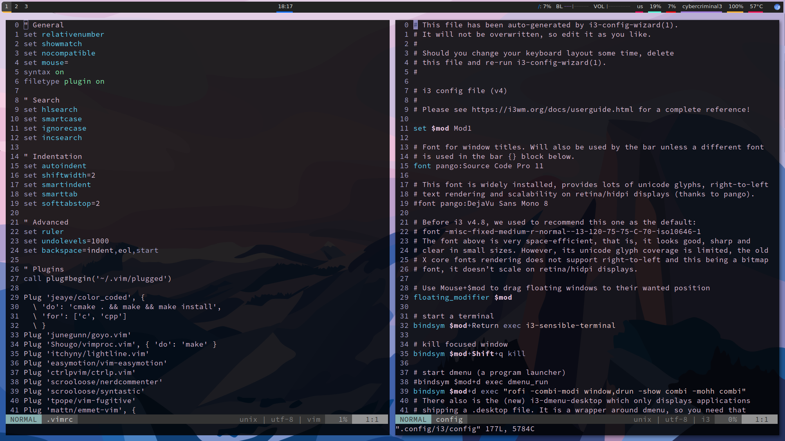
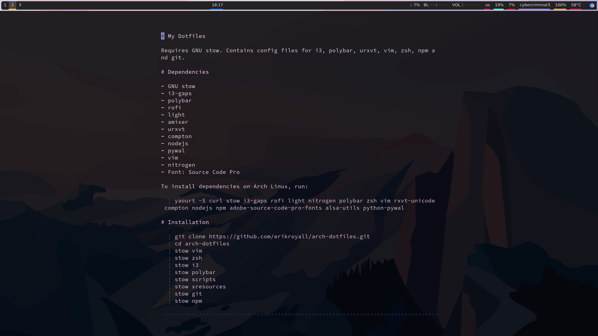
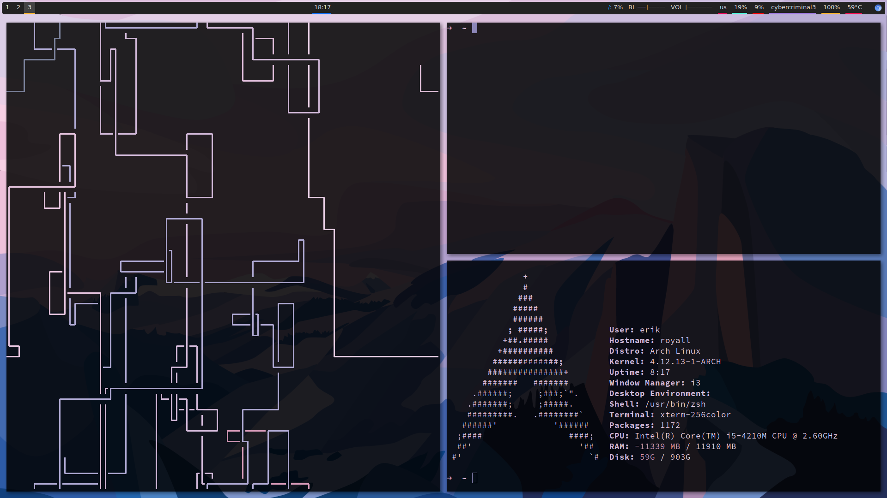

# My Dotfiles

Requires GNU stow. Contains config files for i3, polybar, urxvt, vim, zsh, npm and git.

# Dependencies

- GNU stow
- i3-gaps
- polybar
- rofi
- light
- scrot
- amixer
- urxvt
- compton
- nodejs
- pywal
- vim
- nitrogen
- Font: Source Code Pro

To install dependencies on Arch Linux, run:

    yaourt -S curl stow i3-gaps rofi light scrot nitrogen polybar zsh vim rxvt-unicode compton \
        nodejs npm adobe-source-code-pro-fonts alsa-utils python-pywal

On Ubuntu:

    sudo apt install build-essential rofi curl stow scrot nitrogen zsh vim rxvt-unicode \
        compton alsa-utils python3 python3-pip imagemagick
    
    # Pywal
    sudo pip3 install pywal
    
    # Light
    git clone https://github.com/haikarainen/light.git
    cd light
    make
    sudo make install
    cd ~
    
    # Nodejs
    curl -sL https://deb.nodesource.com/setup_8.x | sudo -E bash -
    sudo apt-get install -y nodejs
    
    # i3-gaps
    sudo apt install libxcb1-dev libxcb-keysyms1-dev libpango1.0-dev libxcb-util0-dev \
        libxcb-icccm4-dev libyajl-dev libstartup-notification0-dev libxcb-randr0-dev libev-dev libxcb-cursor-dev  \
        libxcb-xinerama0-dev libxcb-xkb-dev libxkbcommon-dev libxkbcommon-x11-dev  \
        autoconf libxcb-xrm0 libxcb-xrm-dev automake
    git clone https://www.github.com/Airblader/i3 i3-gaps 
    cd i3-gaps
    autoreconf --force --install
    rm -rf build/
    mkdir -p build && cd build/
    ../configure --prefix=/usr --sysconfdir=/etc --disable-sanitizers
    make
    sudo make install

# Installation

    git clone https://github.com/erikroyall/arch-dotfiles.git
    cd arch-dotfiles
    stow vim
    stow zsh
    stow i3
    stow polybar
    stow scripts
    stow xresources
    stow git
    stow npm

# Post-Installation steps

- Install vim-plug

      curl -fLo ~/.vim/autoload/plug.vim --create-dirs \
      https://raw.githubusercontent.com/junegunn/vim-plug/master/plug.vim

      vim +PlugInstall +qall

- Install antigen

      cd ~
      curl -L git.io/antigen > antigen.zsh

- Set a new wallpaper

      cd arch-dotfiles
      wal -i wallpaper.png

# Screenshots

